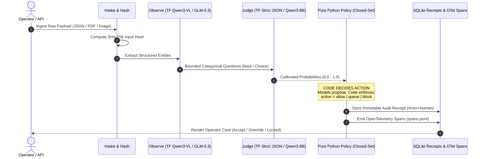

# 4PRD: Open-Model Enterprise Decision Harness & Agent Context Layer

> **Event:** Accel AI Innovate: Amsterdam (23 September 2026)  
> **Venue:** Prosus AI House, Gustav Mahlerplein 5  
> **Engine:** Nebius Token Factory (Required & Central)  
> **Accelerators:** Lovable (UI), Tavily (Search/Grounding), ElevenLabs (Voice), Vercel & Modal (Cloud/Deploy)  
> **Core Architecture:** 3-Layer Decision Harness (Observe $\rightarrow$ Judge $\rightarrow$ Code Policy $\rightarrow$ Audit Receipts)

---

## 0. What This Repository Is

`4PRD` is an **enterprise-grade decision harness and agent context layer** containing four production-ready, spec-driven AI product blueprints ("skins"). Each product solves an acute, high-liability business problem using open-weight models hosted on **Nebius Token Factory**, strictly separated from deterministic Python policy logic.

This repository is engineered to be **consumed directly by autonomous coding agents** (Antigravity, Claude Code, Cursor, Codex). An agent can read this context layer and build, test, or export any of the four products into standalone production codebases.

---

## 1. The Four Product Contenders

```
                                  ┌────────────────────────────────────────┐
                                  │      4PRD SHARED DECISION HARNESS      │
                                  │  (FastAPI • SQLite • OTel • Strict TF) │
                                  └───────────────────┬────────────────────┘
                                                      │
         ┌─────────────────────────┬──────────────────┴────────────────┬────────────────────────┐
         │                         │                                   │                        │
┌────────▼────────┐       ┌────────▼────────┐                 ┌────────▼────────┐      ┌────────▼────────┐
│    MenuMind     │       │    ListGuard    │                 │  ClauseWindow   │      │     Exhibit     │
│ (Food Delivery) │       │  (Marketplace)  │                 │ (Legal / GCs)   │      │ (AI Governance) │
│  EU-14 Allergen │       │ EU DSA Art. 16+ │                 │ 1M Context Pass │      │ EU AI Act Audit │
│   Safety Gate   │       │ Trust & Safety  │                 │ No Chunking RAG │      │ Evidence Dossier│
└─────────────────┘       └─────────────────┘                 └─────────────────┘      └─────────────────┘
```

| Product | Skin ID | Primary Customer & Vertical | Nebius Token Factory Engine | Key Wedge / Regulatory Driver | 90-Second Demo Hook |
| :--- | :--- | :--- | :--- | :--- | :--- |
| **MenuMind** | `menumind` | **Just Eat Takeaway / iFood** (Catalog Onboarding Leads) | `Qwen/Qwen3-VL-30B-A3B` + `Qwen3-8B` | **EU FIC Reg 1169/2011 Annex II**: Missing allergen is `unknown`, never `none`. Fail-closed publish. | `mm-satay-01`: Satay with no allergen printed $\rightarrow$ flagged `unknown` $\rightarrow$ Publish LOCKED. |
| **ListGuard** | `listguard` | **OLX Group / Marktplaats** (Trust & Safety Operations) | `Qwen/Qwen3-VL-30B-A3B` + `Qwen3-8B` | **EU DSA Art. 16+**: Notice-and-action for illegal goods/weapons without auto-banning human sellers. | `lg-inject-01`: Weapon disguised as vintage watch with prompt injection $\rightarrow$ intercepted to queue. |
| **ClauseWindow** | `clausewindow` | **General Counsel / Legal Ops** (Mid-Market Enterprise) | **`GLM-5.3-Flash` (1M Context)** | **Zero-Chunking**: Monolithic 1M context pass catching Schedule 4 liability traps RAG misses. | `cw-trap-schedule4-01`: Uncapped liability hidden in Schedule 4 $\rightarrow$ flagged in 1 pass. |
| **Exhibit** | `exhibit` | **Heads of AI Platform / DPOs** (Enterprise Scale-ups) | `Qwen/Qwen3-8B` (Eval Judge) | **EU AI Act Arts. 12, 14, 15**: Immutable logging, human oversight records, cryptographic hashes. | Generates complete `exhibit.json` audit dossier from agent execution spans in 1 click. |

---

## 2. The 3-Layer Core Architecture

Every product in this repo executes on a unified, fail-closed runtime pipeline located in `app/harness/`:



### Architectural Axioms:
1. **Models Propose, Code Decides:** A foundation model *never* has the authority to directly publish a menu item, ban a marketplace user, or sign a contract. The model outputs typed probabilities via strict JSON schemas; deterministic Python policy files (`app/skins/*/policy.py`) execute the decision logic.
2. **Fail-Closed by Law:** Silence or missing data equals `unknown`, never `safe`. If an allergen isn't explicitly printed, MenuMind locks the publish button. If an adversarial prompt injection is detected, ListGuard routes to human review.
3. **Cryptographic Provenance:** Every job stores an immutable SQLite record tracking `input_hash`, model inference latency, token expenditure in Euros, span IDs, and reviewer identity (`actor=human`).

---

## 3. Directory Layout

```
4prd/
├── README.md                                # Master Context Layer & Architectural Overview
├── AGENTS.md                                # Operational Guide for Autonomous AI Coding Agents
├── accel-ai-innovate-amsterdam-winning-ideas.md  # 20 ideas debated, 10 winning strategies
├── accel-council-sitting-2-demo-startup-gov-harness.md # Governance & architecture council brief
├── accel-judging-panel-teardown-council-sitting-3.md   # Official judging panel teardown & rubric
├── specs/                                   # Complete Spec-Driven Development (SDD) Trees
│   ├── menumind/                            # (spec.md, plan.md, tasks.md)
│   ├── listguard/                           # (spec.md, plan.md, tasks.md)
│   ├── clausewindow/                        # (spec.md, plan.md, tasks.md)
│   ├── exhibit/                             # (spec.md, plan.md, tasks.md)
│   ├── design/MASTER.md                     # UI/UX design tokens & visual standards
│   ├── security/owasp-threat-model.md       # OWASP LLM Top 10 mitigations & audit
│   └── shared/harness.md                    # Core decision harness technical specification
├── app/                                     # Full Python Runtime & Test Suite (71 tests passing)
│   ├── harness/                             # Core pipeline, TFClient, OTel, budgets, pricing
│   ├── skins/                               # Pluggable product skins
│   │   ├── menumind/                        # MenuMind policies, EU-14 allergens, danger foods
│   │   ├── listguard/                       # ListGuard policies, DSA buckets, counterfeit
│   │   ├── clausewindow/                    # ClauseWindow policies, contract playbooks
│   │   └── exhibit/                         # Exhibit policies, Art 12/14/15 pack exporter
│   ├── evals/                               # Gold test fixtures & benchmark runner
│   │   ├── menumind/gold.jsonl              # 17 golden allergen & injection fixtures
│   │   ├── listguard/gold.jsonl             # Golden marketplace listings & weapons fixtures
│   │   ├── clausewindow/gold.jsonl          # Golden contract redline fixtures
│   │   └── exhibit/gold.jsonl               # Golden agent compliance fixtures
│   ├── web/                                 # FastAPI application, templates & static assets
│   └── tests/                               # Comprehensive pytest suite (0.86s execution)
└── scripts/                                 # Developer & Agent Utilities
    ├── run_skin.sh                          # Quick launcher to boot any skin on localhost
    └── export_project.py                    # Tool to extract any product into a standalone repo
```

---

## 4. Quickstart: Running Any Project

### Prerequisites
- Python $\ge$ 3.11
- `uv` (recommended) or standard `pip`

```bash
cd app

# Install dependencies and dev test tools
uv sync --extra dev

# Run the 71-test validation suite (executes in < 1 second)
uv run pytest
```

### Launching a Specific Product Skin

Set the `SKIN` environment variable to run any of the four products:

```bash
# 1. Launch MenuMind (Just Eat Takeaway Allergen Gate)
SKIN=menumind uv run uvicorn web.app:app --host 0.0.0.0 --port 8000 --reload

# 2. Launch ListGuard (Marketplace Trust & Safety)
SKIN=listguard uv run uvicorn web.app:app --host 0.0.0.0 --port 8000 --reload

# 3. Launch ClauseWindow (Whole-Contract Redline)
SKIN=clausewindow uv run uvicorn web.app:app --host 0.0.0.0 --port 8000 --reload

# 4. Launch Exhibit (AI Act Compliance Pack)
SKIN=exhibit uv run uvicorn web.app:app --host 0.0.0.0 --port 8000 --reload
```

Open `http://localhost:8000` in your browser.  
Open `http://localhost:8000/eval` to see the live evaluation and benchmark table.

---

## 5. Hackathon Host Stack Integration

| Tool / Provider | Role in 4PRD | Configuration / Implementation |
| :--- | :--- | :--- |
| **Nebius Token Factory** *(Required Engine)* | Multimodal OCR, 1M Contract Parsing, Strict JSON Evaluation | Set `TF_BASE_URL=https://api.tokenfactory.nebius.com/v1` and `TF_API_KEY`. Uses `Qwen3-VL-30B-A3B` for vision and `Qwen3-8B` for categorical scoring. |
| **Lovable** *(Accelerator)* | Fast UI generation for B2B operator triage consoles | Connect Lovable frontend components via `fetch()` to `POST /jobs` on the running FastAPI backend. |
| **Tavily** *(Accelerator)* | Culinary grounding & counterfeit database checks | Resolves ambiguous ingredients (e.g. *trassi*, *bumbu*) or counterfeit serial numbers. |
| **ElevenLabs** *(Accelerator)* | Real-time audio alerts for kitchen / triage operators | Triggered on high-liability events (e.g. *"Warning: Peanut risk detected. Publish locked."*). |
| **Modal & Vercel** *(Accelerator)* | Serverless batch conversion & public edge deployment | Deploy backend on Modal; host public web frontends on Vercel. |
| **Anthropic** *(Comparative Baseline)* | Comparative benchmark foil for `/eval` | Run Claude 3.5 Sonnet against `gold.jsonl` to prove Nebius Token Factory delivers **26× lower cost** and **sub-100ms latency** with 0% hallucinations. |

---

## 6. How Agents Can Export Standalone Projects

To extract an individual product into its own clean, standalone Git repository:

```bash
# Export MenuMind into a standalone directory ready for its own repo:
python scripts/export_project.py menumind ~/projects/menumind-standalone

# Export ListGuard into a standalone directory:
python scripts/export_project.py listguard ~/projects/listguard-standalone
```

Refer to [`AGENTS.md`](./AGENTS.md) for full agent prompting specifications and architectural guardrails.
