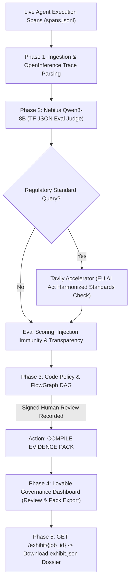

# Exhibit — Specification (Supercharged Edition)

**Skin:** `exhibit`  
**Vertical:** AI Agent Governance & EU Regulatory Evidence Packs  
**Named User:** Dr. Aris Thorne, Lead AI Governance Engineer & DPO  
**Host Engine:** Nebius Token Factory (`Qwen3-8B` JSON Eval Judge)  
**Accelerators:** Lovable (Compliance Export Console), Tavily (Harmonized Standards Grounding)  
**Core Regulatory Anchor:** EU AI Act (Arts. 12 Automatic Logging, 14 Human Oversight, 15 Accuracy & Cybersecurity)  
**Constitutional Rule:** Not a conformity assessment. Counsel classifies. Exhibit produces immutable engineering artifacts.

---

## 1. Problem & Customer Persona

European enterprises deploying autonomous AI agents face severe penalties under the EU AI Act if their systems lack verifiable technical documentation, automated event logging (Article 12), and demonstrated human oversight (Article 14). Observability platforms capture low-level traces, but compliance officers and external auditors require an auditable, cryptographic dossier mapping directly to statutory articles.

**Job To Be Done:** Harvest agent execution spans $\rightarrow$ score traces using Nebius Token Factory JSON judges $\rightarrow$ bind signed human review signatures $\rightarrow$ compile and export `exhibit.json` mapped strictly to EU AI Act Articles 12, 14, and 15.

---

## 2. 5-Phase End-to-End System Architecture

---

## 3. User Stories & Acceptance Criteria

### US-1: OTel Span Ingestion (P0)
- **Actor:** AI Platform Engineer.
- **AC:** Ingests execution spans from `spans.jsonl` matching OpenInference schemas with child spans: `harness.observe` $\rightarrow$ `harness.judge` $\rightarrow$ `harness.policy`.

### US-2: TF-Native Trace Evaluation (P0)
- **Actor:** Automated Auditor.
- **AC:** Nebius Token Factory `Qwen3-8B` scores agent traces for:
  - `injection_caught`: Did the policy intercept adversarial inputs?
  - `schema_valid`: Did the output strictly conform to JSON schema?
  - `disclosure_present`: Did the system declare itself as AI decision support (Article 50)?

### US-3: Article 14 Human Oversight Recording (P0)
- **Actor:** Compliance Operator.
- **AC:** Captures reviewer identity, timestamp, and decision (`confirm` or `override_queue`) directly into SQLite receipt. Pack field `art14_review` is non-empty. Anonymous system approvals are prohibited.

### US-4: Exhibit Pack Generation (P0)
- **AC:** `GET /exhibit/{job_id}` returns a complete `exhibit.json` containing:
  - `article_12_logging`: Full cryptographic input/output hashes and execution timestamps.
  - `article_14_human_oversight`: Named reviewer credentials and intervention history.
  - `article_15_cybersecurity`: Injection test suite pass rates and accuracy metrics.
  - `limitations`: Explicit declaration of what the model cannot guarantee.

---

## 4. Live 90-Second Demo Script

1. **00:00 - 00:25**: Trigger an agent workflow containing hostile injection `ex-inject-01`.
2. **00:25 - 00:50**: Show OpenTelemetry trace in Lovable console displaying child spans: `harness.observe` $\rightarrow$ `harness.judge` $\rightarrow$ `harness.policy`.
3. **00:50 - 01:10**: Operator reviews and accepts the trace. Show the receipt stamped with `actor=human` and Dr. Aris Thorne’s credentials.
4. **01:10 - 01:30**: Click `Download Exhibit Pack`. Instantly open `exhibit.json` mapped directly to EU AI Act Articles 12, 14, and 15.
