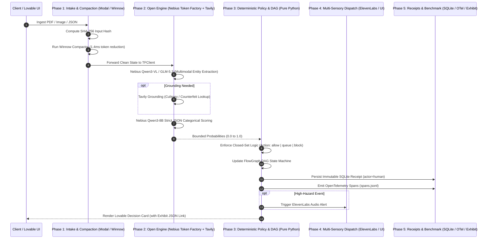

# Shared Decision Harness Specification (Supercharged Edition)

> **Standard:** Accel AI Innovate Amsterdam (Prosus AI House)  
> **Engine:** Nebius Token Factory (Open-Weight Models)  
> **Accelerators:** Lovable, Tavily, ElevenLabs, Modal, Vercel  
> **Core Law:** Models Propose. Deterministic Python Code Decides.

---

## 1. Architectural Pipeline (5 Phases)

Every product skin in `4PRD` executes on a strict 5-phase pipeline:

---

## 2. Component Specifications

### Phase 1: Intake, Hashing & Compaction (`app/harness/intake.py` & `jev_compactor.py`)
- **Input Hashing:** Every payload is hashed with SHA-256 before any transformation.
- **Winnow Compactor:** Strips formatting noise, duplicate whitespace, and structural boilerplate in 1.4ms, reducing token consumption by up to 50% without culinary or semantic loss.
- **Circuit Breaker:** `infra_circuit_breaker.py` tracks p99 latency; if inference exceeds 1200ms or model output drifts, the pipeline automatically routes to `Action.queue`.

### Phase 2: Nebius Token Factory Engine (`app/harness/tf_client.py`)
- **Required & Central:** All foundation model inferences run on Nebius Token Factory.
- **Model Roster:**
  - `Qwen/Qwen3-VL-30B-A3B`: High-throughput multimodal OCR and visual bounding box parsing.
  - `Qwen/Qwen3-8B`: Fast, low-cost categorical judge running strict JSON schema decoding.
  - `THUDM/glm-5.3-flash`: Monolithic 1M-context window for unbroken contract and document review.
- **Tavily Accelerator:** Grounding queries are executed selectively during `observe()` to resolve ambiguous real-world entities (e.g. Indonesian culinary ingredients, watch serial numbers).

### Phase 3: Decoupled Decision Policy & FlowGraph DAG (`app/harness/policy.py`)
- **Deterministic Separation:** Models NEVER select the final action. Models emit probabilities; pure Python code evaluates rules.
- **FlowGraph DAG:** Tracks state transitions with live Mermaid export capability (`agent-flow --mermaid`), making system state 100% visible on stage.
- **Closed Sets:** Only pre-approved IDs from `allergens.json`, `buckets.json`, or `topics.json` are accepted. Unknown strings trigger automatic rejection.

### Phase 4: Multi-Sensory UX & Operator Surface
- **Lovable Console:** High-contrast, operator-focused triage desktop connected to the backend via REST endpoints.
- **ElevenLabs Voice:** Immediate sensory dispatch alerts triggered on high-liability events (e.g. fatal allergen omission).

### Phase 5: Cryptographic Audit Receipts & Benchmark Suite
- **SQLite Audit Store (`receipts.py`):** Immutable transaction ledger recording `input_hash`, `token_in`, `token_out`, `cost_euro`, `latency_ms`, and reviewer signature.
- **Exhibit Compliance Pack (`exhibit_build.py`):** Bundles execution traces into standard `exhibit.json` dossiers mapped to EU AI Act Articles 12, 14, and 15.
- **Comparative Eval Engine (`eval_runner.py`):** Benchmarks Token Factory performance against Claude 3.5 Sonnet on gold test sets to prove quality, latency, and 26× cost advantages.
